## Overview

Human memory is selective in nature: information that is rarely used or insufficiently reinforced tends to be partially forgotten over time. This is related to incomplete consolidation, interference between pieces of knowledge, and mechanisms for selecting relevant information. Under normal conditions, this property of memory is adaptive, as it reduces the influence of competing or less relevant memories. However, in learning, research, and long-term projects, it creates a problem: important knowledge gradually fades without systematic review. That is why repetition becomes necessary.

**Review Tracker** is an Obsidian plugin designed to organize note review using predefined time intervals. Its main function is to help users see which notes should be reviewed, when they should return to them, and which review intervals have already been completed.

## Important Clarification

**Review Tracker** is not a flashcard system and does not guarantee memorization. It does not test knowledge in a question-and-answer format; rather, it simply helps users see which of their own notes should be reviewed at certain intervals.

Its main purpose is to make note review more organized by showing which notes should be revisited after a few days, weeks, or other defined periods of time.

## Installation

### Via Community Plugins

Once the plugin becomes available in the official Obsidian Community Plugins catalog:

1. Open **Settings** → **Community plugins** → **Browse**
2. Search for **Review Tracker**
3. Click **Install**
4. Enable the plugin in the **Installed plugins** list

### Manual Installation

If the plugin has not yet been added to the Community Plugins catalog:

1. Go to the latest **GitHub Release**
2. Download `main.js`, `manifest.json`, and `styles.css`
3. Create the following folder inside your vault:

`/.obsidian/plugins/review-tracker/`

4. Copy `main.js`, `manifest.json`, and `styles.css` into this folder
5. Restart Obsidian
6. Open **Settings** → **Community plugins**
7. Find **Review Tracker** in the list of installed plugins
8. Enable it

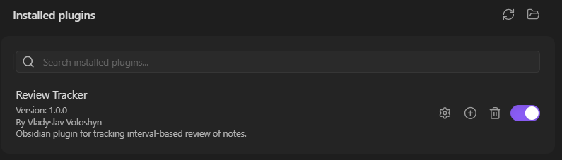

## How to Start Using Review Tracker

To make Review Tracker detect a note, the note must contain two things in its **Properties**:

1. a tag used for review  
2. a starting date from which the review intervals are counted

### Step 1. Create a note

Create a new note, for example:

`Example Note`

### Step 2. Open Properties

At the top of the note, open the **Properties** section.

If the note does not have any properties yet:

- click the **+** button
- choose **tags**

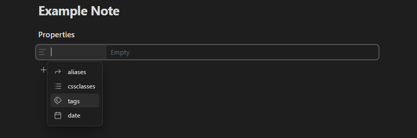

- add the tag used for review, for example: `repeat`

Then click **+** again and create a date property, for example:

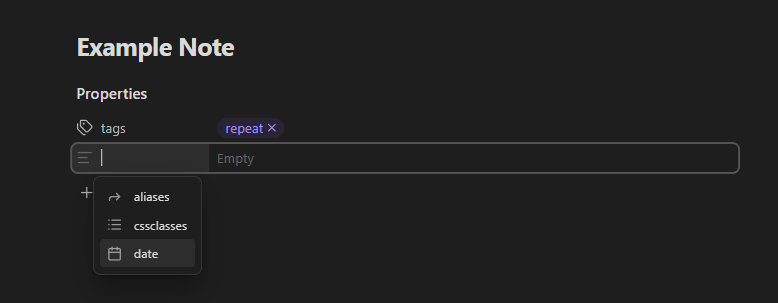

- `date`

After that, enter the starting date of the note.

### Step 3. Example of required properties

A simple example:

- **tags:** `repeat`
- **date:** `2026-03-31`

Source mode:

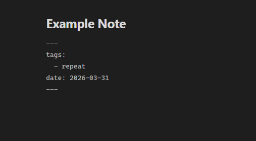

Reading mode:

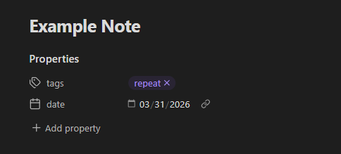

This means:

- the tag tells the plugin that this note should be included in the review system
- the date becomes the **zero day**, which is the starting point for all intervals

### If everything has been set up correctly, the note will appear in **Review Tracker Statistics**.

This means that the note contains:

- the correct review tag
- a valid date in **Properties**

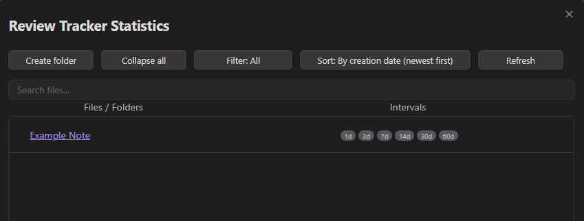

## How the Main Review Tracker Window Works

When the plugin is enabled, a **Review Tracker** button appears in the left sidebar of Obsidian.  
After clicking it, a separate plugin window opens, usually on the right side.

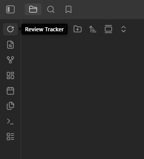

This window shows **the notes that need to be reviewed today**.

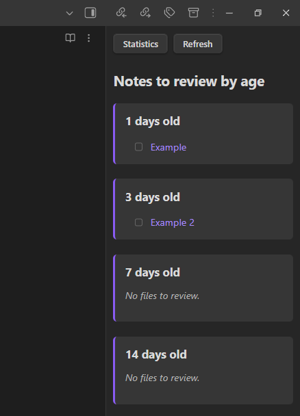

### How to Read the List

Notes are grouped into sections based on review intervals:

- **1 day old** — this section shows notes for which the first review interval has been reached, meaning they should be reviewed 1 day after the starting date
- **3 days old** — this section shows notes for which the 3-day review interval has been reached

### Statistics Button

The **Statistics** button opens a separate statistics window where you can see all notes, their intervals, review progress, hints, missed intervals, and other details.

## Settings

Review Tracker includes a settings panel that allows users to control how notes are selected for review and how review intervals are displayed.

The screenshot below shows the main fields available in the plugin settings:

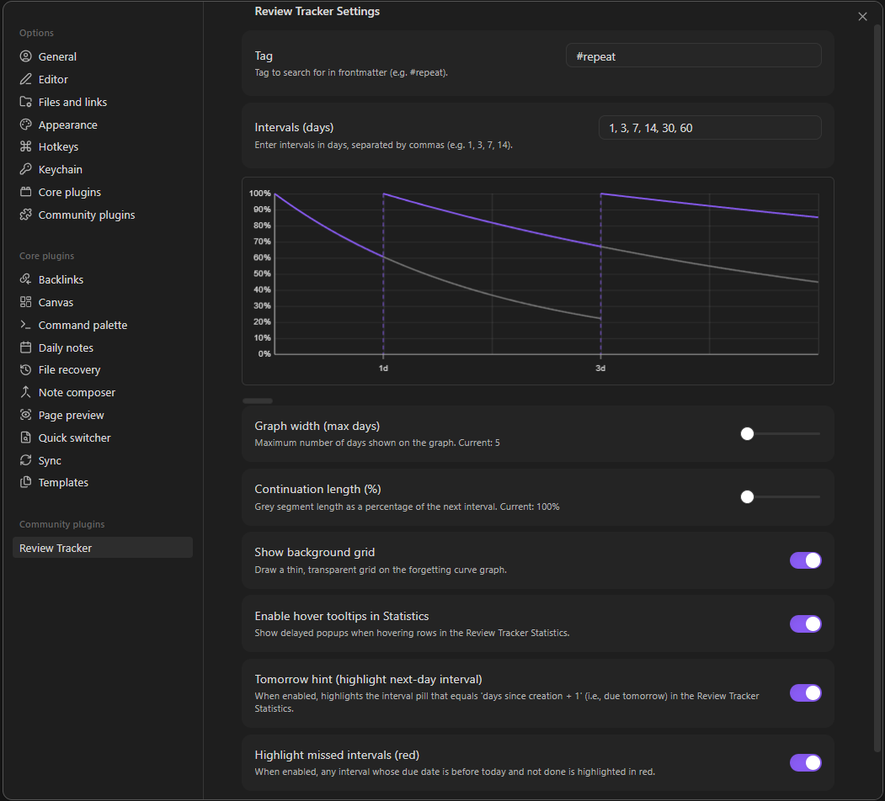

### Tag

The **Tag** field defines which tag the plugin uses to identify notes for review.

For example, if this field is set to `#repeat`, the plugin will work with notes whose properties / frontmatter contains this tag. This makes it possible to separate ordinary notes from the notes you want to include in your review workflow.

In other words, the tag works as a marker that tells the plugin which notes should be tracked for interval-based review.

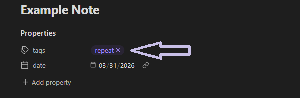

### Intervals (days)

The **Intervals (days)** field allows users to define review intervals in days.

For example, if the field contains:

`1, 3, 7, 14, 30, 60`

this means that the note is scheduled for review:
- 1 day after the starting date,
- 3 days after the starting date,
- 7 days after the starting date,
- 14 days after the starting date,
- 30 days after the starting date,
- 60 days after the starting date.

The starting point is the **zero day**, meaning the initial date from which all intervals are counted.

So these intervals do not mean “repeat every 3 days.” Instead, they represent fixed checkpoints in time: on day 1, day 3, day 7, day 14, and so on from the starting date.

### Forgetting curve graph

The graph in the settings displays a **simplified forgetting curve** together with the selected review intervals.

Its purpose is not to provide an exact scientific model of memory. Instead, it serves as a **visual illustration** showing how the chosen intervals are distributed and how retention may approximately decline between reviews.

In other words, the graph should be understood as an **illustrative visual aid**, not as a precise prediction of how memory works.

### Graph width (max days)

The **Graph width (max days)** setting controls how many days are shown on the graph at once. It affects only the scale of the graph and makes it easier to view either shorter or longer interval ranges.

### Continuation length (%)

The **Continuation length (%)** setting adjusts the length of the grey continuation segment on the graph. This is a visual parameter that helps show how the curve extends beyond the main review point.

### Show background grid

The **Show background grid** option enables a background grid on the graph, which can make it easier to read visually.

### Enable hover tooltips in Statistics

The **Enable hover tooltips in Statistics** option shows tooltips when the user hovers over rows in the statistics modal. This helps display additional information more conveniently.

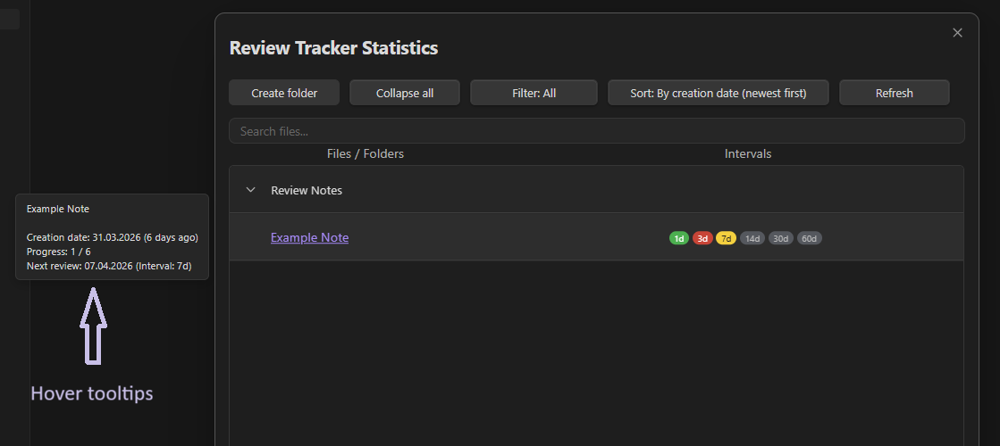

### Tomorrow hint

The **Tomorrow hint** option highlights the interval that will become due tomorrow. This can be useful for seeing which reviews are coming next.

Overall, these settings are intended to make the review process more flexible, more understandable, and easier to adapt to different note-taking and learning workflows.

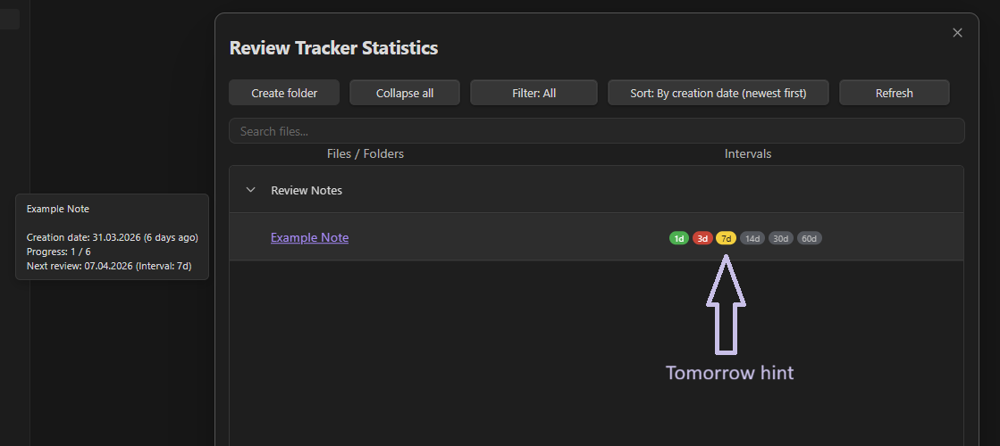

### Highlight missed intervals (red)

The **Highlight missed intervals (red)** option marks overdue review intervals in red.

When this option is enabled, any interval whose scheduled review date is earlier than today and has not been marked as completed will be highlighted in red. This makes it easier to notice missed reviews and quickly identify notes that need attention.

This feature is intended to improve visibility in the review workflow by clearly separating overdue intervals from completed or upcoming ones.

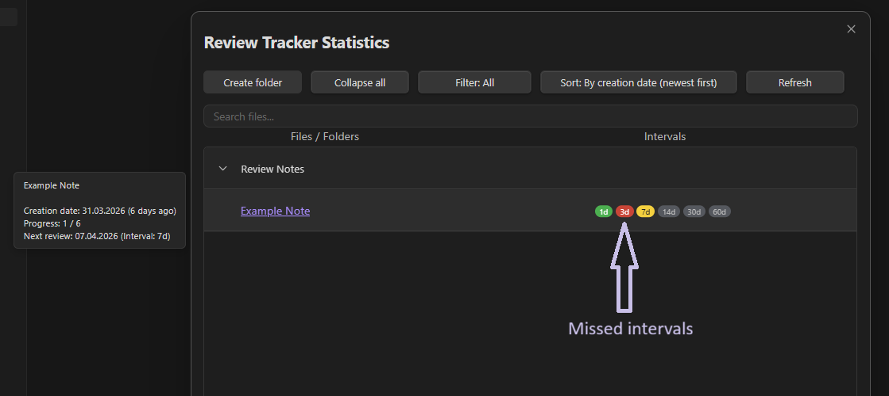

## Recommendation for Use

For better retention of information, it is recommended not to rely solely on rereading a note. A much more effective approach is active recall before reviewing it again.

Therefore, it is advisable to formulate several key questions at the beginning of each note and try to answer them independently before opening or rereading the full text. This approach helps not only to check what has already been retained in memory, but also to make the review process more conscious and effective.
